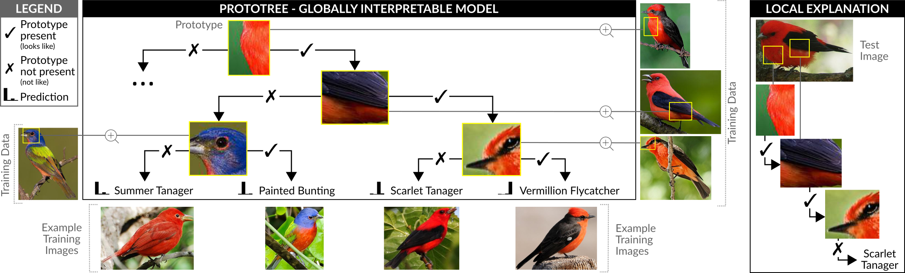

# ProtoTrees: Neural Prototype Trees for Interpretable Fine-grained Image Recognition
This repository presents the PyTorch code for Neural Prototype Trees (ProtoTrees), published at CVPR 2021: ["Neural Prototype Trees for Interpretable Fine-grained Image Recognition"](https://openaccess.thecvf.com/content/CVPR2021/html/Nauta_Neural_Prototype_Trees_for_Interpretable_Fine-Grained_Image_Recognition_CVPR_2021_paper.html). 

A ProtoTree is an intrinsically interpretable deep learning method for fine-grained image recognition. It includes prototypes in an interpretable decision tree to faithfully visualize the entire model. Each node in our binary tree contains a trainable prototypical part. The presence or absence of this prototype in an image determines the routing through a node. Decision making is therefore similar to human reasoning: Does the bird have a red throat? And an elongated beak? Then it's a hummingbird!

Figure shows an example of a ProtoTree. A ProtoTree is a globally interpretable model faithfully explaining its entire behaviour (left, partially shown) and additionally the reasoning process for a single prediction can be followed (right): the presence of a red chest and black wing, and the absence of a black stripe near the eye, identifies a Scarlet Tanager. 

## Prerequisites

### General
* Python 3
* [PyTorch](https://pytorch.org/get-started/locally/) >= 1.5 and <= 1.7!
* Optional: CUDA

### Required Python Packages:
* numpy
* pandas
* opencv
* tqdm
* scipy
* matplotlib
* requests (to download the CARS dataset, or download it manually)
* gdown (to download the CUB dataset, or download it manually)

## Data
The code can be applied to the [CUB-200-2011](http://www.vision.caltech.edu/visipedia/CUB-200-2011.html) dataset with 200 bird species, or the [Stanford Cars](https://ai.stanford.edu/~jkrause/cars/car_dataset.html) dataset with 196 car types. 

The folder `preprocess_data` contains python code to download, extract and preprocess these datasets. 

### Preprocessing CUB
1. create a folder ./data/CUB_200_2011
2. download [ResNet50 pretrained on iNaturalist2017](https://drive.google.com/drive/folders/1yHme1iFQy-Lz_11yZJPlNd9bO_YPKlEU) (Filename on Google Drive: `BBN.iNaturalist2017.res50.180epoch.best_model.pth`) and place it in the folder `features/state_dicts`.
3. from the main ProtoTree folder, run `python preprocess_data/download_birds.py` 
4. from the main ProtoTree folder, run `python preprocess_data/cub.py` to create training and test sets

### Preprocessing CARS
1. create a folder ./data/cars
2. from the main ProtoTree folder, run `python preprocess_data/download_cars.py`
3. from the main ProtoTree folder, run `python preprocess_data/cars.py` to create training and test sets

## Training a ProtoTree
1. create a folder ./runs

A ProtoTree can be trained by running `main_tree.py` with arguments. An example for CUB: `main_tree.py --epochs 100 --log_dir ./runs/protoree_cub --dataset CUB-200-2011 --lr 0.001 --lr_block 0.001 --lr_net 1e-5 --num_features 256 --depth 9 --net resnet50_inat --freeze_epochs 30 --milestones 60,70,80,90,100` To speed up the training process, the number of workers of the [DataLoaders](https://github.com/M-Nauta/ProtoTree/blob/main/util/data.py#L39) can be increased by setting `num_workers` to a positive integer value (suitable number depends on your available memory).

Check your `--log_dir` to keep track of the training progress. This directory contains `log_epoch_overview.csv` which prints per epoch the test accuracy, mean training accuracy and the mean loss. File `log_train_epochs_losses.csv` prints the loss value and training accuracy per batch iteration. File `log.txt` logs additional info. 

The resulting visualized prototree (i.e. *global explanation*) is saved as a pdf in your `--log_dir /pruned_and_projected/treevis.pdf`. NOTE: this pdf can get large which is not supported by Adobe Acrobat Reader. Open it with e.g. Google Chrome or Apple Preview. 

To train and evaluate an ensemble of ProtoTrees, run `main_ensemble.py` with the same arguments as for `main_tree.py`, but include the `--nr_trees_ensemble` to indicate the number of trees in the ensemble. 

### Local explanations
A trained ProtoTree is intrinsically interpretable and globally explainable. It can also *locally* explain a prediction. Run e.g. the following command to explain a single test image:

`main_explain_local.py --log_dir ./runs/protoree_cars --dataset CARS --sample_dir ./data/cars/dataset/test/Dodge_Sprinter_Cargo_Van_2009/04003.jpg --prototree ./runs/protoree_cars/checkpoints/pruned_and_projected`

In the folder `--log_dir` `/local_explanations`, the visualized local explanation is saved in `predvis.pdf`.
